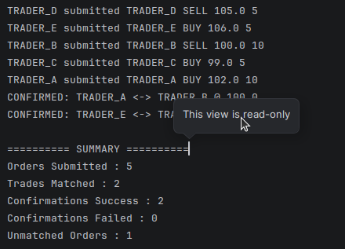

# Order Book Matching Engine

## Overview

A simplified stock exchange Order Book Matching Engine implemented in Java to demonstrate core concurrency concepts. Multiple trader threads submit buy and sell orders concurrently, while a single matching engine processes orders and executes trades. Trade confirmations are handled asynchronously using CompletableFuture.

## Features

* Concurrent order submission by multiple traders
* Producer-Consumer architecture using BlockingQueue
* Single-threaded matching engine
* Trade matching based on BUY price >= SELL price
* Asynchronous trade confirmations using CompletableFuture
* Graceful shutdown and summary reporting
* Demonstrations of common concurrency pitfalls

## Concurrency Concepts Used

| Concept           | Usage                                         |
| ----------------- | --------------------------------------------- |
| Thread & Runnable | NaiveTrader, MatchingEngine                   |
| Callable & Future | TraderTask                                    |
| ExecutorService   | Trader and confirmation thread pools          |
| BlockingQueue     | Shared order queue between traders and engine |
| volatile          | marketOpen flag                               |
| synchronized      | Trade history updates                         |
| ReentrantLock     | Unmatched order buffers                       |
| CompletableFuture | Asynchronous trade confirmations              |

## Project Structure

src/

├── model/

│   ├── Order.java

│   └── Trade.java

├── trader/

│   ├── NaiveTrader.java

│   └── TraderTask.java

├── engine/

│   └── MatchingEngine.java

├── confirmation/

│   └── TradeConfirmer.java

├── pitfalls/

│   └── Pitfalls.java

├── util/

│   └── OrderParser.java

└── Main.java

## Sample Input

TRADER_A BUY 102 10

TRADER_B SELL 100 10

TRADER_C BUY 99 5

TRADER_D SELL 105 5

TRADER_E BUY 106 5

## Sample Output
# Order Book Matching Engine

## Overview

A simplified stock exchange Order Book Matching Engine implemented in Java to demonstrate core concurrency concepts. Multiple trader threads submit buy and sell orders concurrently, while a single matching engine processes orders and executes trades. Trade confirmations are handled asynchronously using CompletableFuture.

## Features

* Concurrent order submission by multiple traders
* Producer-Consumer architecture using BlockingQueue
* Single-threaded matching engine
* Trade matching based on BUY price >= SELL price
* Asynchronous trade confirmations using CompletableFuture
* Graceful shutdown and summary reporting
* Demonstrations of common concurrency pitfalls

## Concurrency Concepts Used

| Concept           | Usage                                         |
| ----------------- | --------------------------------------------- |
| Thread & Runnable | NaiveTrader, MatchingEngine                   |
| Callable & Future | TraderTask                                    |
| ExecutorService   | Trader and confirmation thread pools          |
| BlockingQueue     | Shared order queue between traders and engine |
| volatile          | marketOpen flag                               |
| synchronized      | Trade history updates                         |
| ReentrantLock     | Unmatched order buffers                       |
| CompletableFuture | Asynchronous trade confirmations              |

## Project Structure

src/

├── model/

│   ├── Order.java

│   └── Trade.java

├── trader/

│   ├── NaiveTrader.java

│   └── TraderTask.java

├── engine/

│   └── MatchingEngine.java

├── confirmation/

│   └── TradeConfirmer.java

├── pitfalls/

│   └── Pitfalls.java

├── util/

│   └── OrderParser.java

└── Main.java

## Sample Input

TRADER_A BUY 102 10

TRADER_B SELL 100 10

TRADER_C BUY 99 5

TRADER_D SELL 105 5

TRADER_E BUY 106 5

## Sample Output

## Concurrency Pitfalls Demonstrated

* Race Condition (Synchroniztion/Collections.synchronizedList())
* Deadlock
* volatile is not sufficient for counters
* CompletableFuture.get() causing serialization
*

## Concurrency Pitfalls Demonstrated

* Race Condition (Synchroniztion/Collections.synchronizedList())
* Deadlock
* volatile is not sufficient for counters
* CompletableFuture.get() causing serialization
*

